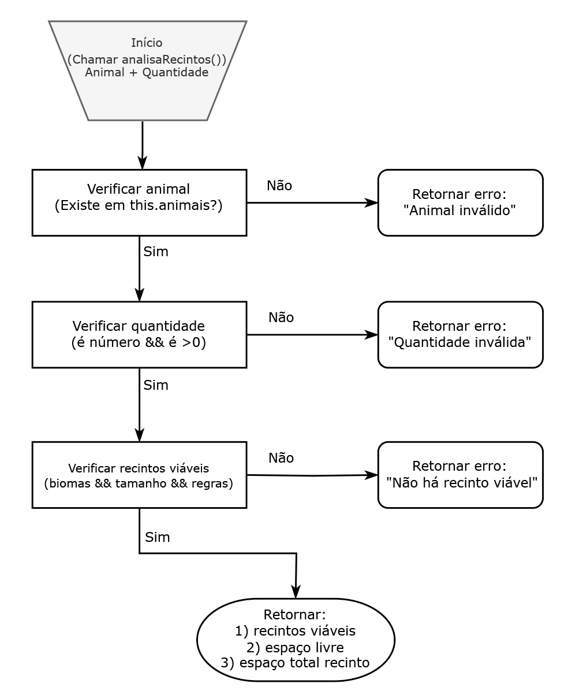

# Desafio de Lógica - Gerenciamento de Recintos de Zoológico

Este projeto foi desenvolvido para um desafio de lógica envolvendo a gestão de recintos em um zoológico. O objetivo é determinar os recintos viáveis para abrigar diferentes animais, levando em consideração fatores como biomas, espaço disponível, convivência entre espécies e comportamento animal.

## 📌 Motivação
Este projeto foi desenvolvido como parte de um desafio técnico usando Javascript proposto para apresentar habilidades em resolução de problemas e implementação de testes automatizados.

## 🔨 Funcionalidades do projeto

- `Validação de animais`: Identifica espécies inválidas.
- `Regras de bioma`: Verifica se o recinto é adequado para o bioma do animal.
- `Convivência entre espécies`: Garante que espécies carnívoras só sejam alocadas com a mesma espécie, e outros critérios de convivência.
- `Gestão de espaço`: Calcula o espaço disponível em cada recinto para garantir que a quantidade de animais possa ser acomodada.
- `Testes automatizados`: Validação da lógica por meio de testes unitários utilizando Jest.

## 📌 Flowchart
Abaixo está um fluxograma que descreve o processo de decisão utilizado para validar e alocar os animais nos recintos, de acordo com as regras de biomas, espaço e convivência.



## 📌 Como Executar

- **Instale as dependências**
```sh
npm install
```
- **Execute os testes**
Os testes foram desenvolvidos usando o framework Jest. Para validar a solução e garantir o funcionamento correto do código, rode o seguinte comando:


```sh
npm test
```
- **Estrutura dos Testes**
Os testes estão localizados no arquivo `recintos-zoo.test.js` e atende os seguintes requisitos:
1. Animal inválido: Valida se a função retorna erro quando um animal não cadastrado é solicitado.
2. Quantidade inválida: Verifica a entrada de quantidades não permitidas.
3. Recintos viáveis: Testa se a função retorna corretamente os recintos disponíveis para um animal específico e as específicas quantidades.
4. Regras de convivência: Valida a coexistência entre carnívoros de mesma espécie, além de regras específicas para certas espécies, como hipopótamos e macacos.

## 💻  Tecnologias Utilizadas
- JavaScript (Node.js)
- Jest para testes automatizados

## 📌 Próximos Passos
- Adicionar uma interface gráfica (UI) para facilitar a visualização dos recintos e animais.


## 🔗 Contribuição
Se você quiser contribuir com este projeto, fique à vontade para abrir uma issue ou enviar um pull request. Sugestões e melhorias são sempre bem-vindas!